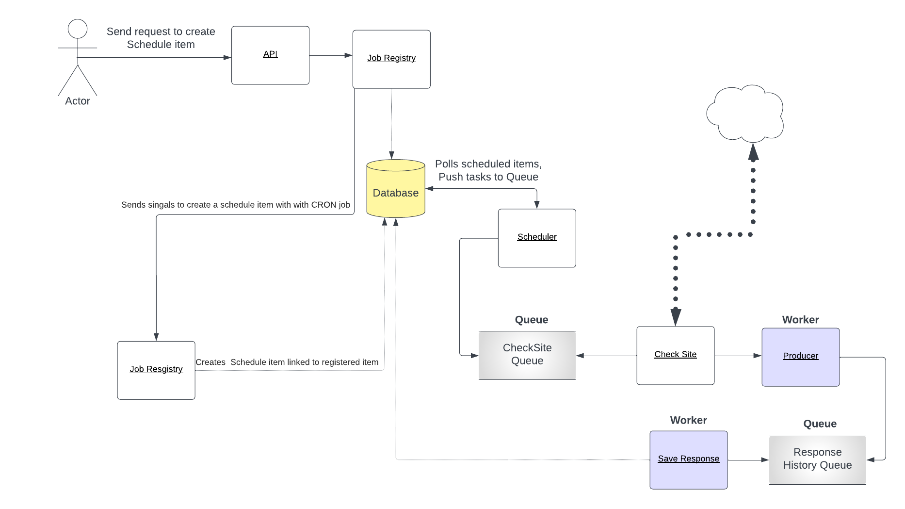

# Uptime Monitor

Uptime Monitor App


[](https://github.com/ambv/black)

License: MIT


# Architecture



## Scheduler

The Scheduler plays a pivotal role in the overall orchestration of this system. Its core function is to manage the timetable for tasks based on a pre-determined configuration, with a key focus on website registry checks. These checks can be scheduled to occur at various intervals as required, providing flexibility and adaptability to the demands of the system.

In this particular implementation, each Scheduler task is time-based, wherein it gets activated as per its schedule, generates a new job, and commits it to the database using a straightforward insert-from-select operation. The Scheduler leverages the robustness of Celery Beat, a popular task scheduler, and a persistent data storage system (a database) to securely store the tasks. This combination of technologies ensures that tasks are not lost and are executed timely, maintaining the integrity of the uptime monitoring system.

## Workers

The Worker component serves as the active agent that interprets and executes the tasks generated by the Scheduler. In essence, it inspects the job queue, initiates website checks, and generates messages to a Celery queue. The system incorporates two distinct queues: one dedicated for Celery tasks and another specifically designed to preserve the history of website responses.


The Worker pushes the website response history to the designated queue using a Celery task defined in 'uptime_monitor/core/producer.py'. This task is essentially a producer that generates data to be consumed by another part of the system.

Multiple Workers can be deployed across numerous machines, all requiring only a connection to the database to access new jobs. This ability to horizontally scale enhances the system's capacity to monitor a large number of websites concurrently and efficiently.

## Consumer

The Consumer component acts as a crucial link in this system, serving as a Celery consumer. It collects responses from the queue and writes them to the database, thus ensuring that all website check data is securely stored for further analysis.

The system employs three models: SiteRegistry, ScheduleItem, and SiteResponseHistory. The SiteRegistry model contains detailed information about each website, including its URL, the time it was last updated, and its last status. The SiteResponseHistory model keeps a meticulous record of various aspects of the website's response, including response code, response text, response time, and response headers.

The system efficiently monitors website uptime, records pertinent data, and ensures that this data is safely stored and ready for further analysis or reporting.


# Setup

```shell
    docker-compose up # run the app
    docker-compose exec django python manage.py migrate # run migrations
```

You can access the app at http://localhost:8000
## Basic Commands

### Setting Up Your Users


On local setup, you can use
```text
username: demo
password: demo
```


### Type checks

Running type checks with mypy:

    $ mypy uptime_monitor

### Test coverage

To run the tests, check your test coverage, and generate an HTML coverage report:

    $ coverage run -m pytest
    $ coverage html
    $ open htmlcov/index.html

#### Running tests with pytest
```shell
    $ pytest    # within the container
```


# Requirements
    - Python 3.8
    - Docker
    - Docker Compose